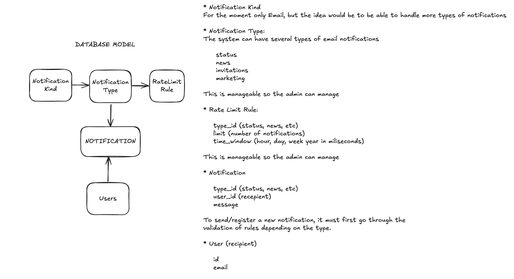

# 📭 Rate-Limited Notification Service By Rodrigo F

## 📄 Project Description

This project implements a rate-limited notification API that sends email notifications of various types (status updates, daily news, project invitations, etc.). The system protects recipients from receiving too many emails due to system errors or abuse by enforcing rate limit rules for different types of notifications.

The types of notifications and rate limit rules are dynamic, allowing users to define and manage them as needed.

## 🎛️ Features
- Rate-limiting for various types of notifications to prevent spam.


- Dynamic management of notification types.


- Dynamic management of rate limit rules.

## 🛠️ Technologies Used

- **Kotlin**: A modern, statically-typed programming language used for building the application.


- **Ktor**: A Kotlin framework for building asynchronous servers and clients. It is used to create the API endpoints.


- **Exposed**: An ORM (Object-Relational Mapping) framework for Kotlin. It is used for database interactions with SQLite.


- **Koin**: A lightweight dependency injection framework for Kotlin. It is used for managing dependencies in the application.


- **JUnit**: A widely used testing framework for Java and Kotlin. It is used for writing and running unit tests.


## ⚙️ Installation and Configuration

1. git clone [https://github.com/elkinff/modak-rodrigo.git](https://github.com/elkinff/modak-rodrigo.git)

    cd modak-rodrigo


2. Install dependencies: 
    ```sh
    ./gradlew build

3. Requirements:

   * Java Development Kit (JDK) 11 or higher: Ensure you have JDK installed. You can download it from AdoptOpenJDK https://adoptopenjdk.net/ or any other provider.
   

   * Gradle: Gradle is used for building and managing dependencies. You can install it from here.

   
   * Kotlin: The project uses Kotlin, which is included in the Gradle build script.

   
   * SQLite: The project uses SQLite as the database. Make sure SQLite is installed on your system. You can download it from here.


4. Database configuration:

   This project uses SQLite as the database. The database structure is already created and includes seeds to populate the system. No additional configuration is needed for the database.


5. Run the application:

    ```sh
   ./gradlew run

  The service will be available at http://0.0.0.0:8080. You can access the API endpoints using this address.
    
## Running Tests

To run the unit tests for the project, follow these steps:

1. **Run the tests**:
   ```sh
   ./gradlew test

This command will execute all unit tests and display the results in the terminal.

2. **Check test results:**

After running the tests, you can find the test results in the build directory:

Test reports: build/reports/tests/test/index.html
Test results in XML format: build/test-results/test


3. **Run specific tests**:

If you need to run a specific test or test class, use the following command:

    
    ./gradlew test --tests "com.example.NotificationServiceTest"


Replace com.example.NotificationServiceTest with the fully qualified name of the test class you want to run.

Ensure that all dependencies and configurations are correctly set up before running the tests. 

If any issues arise, check the test logs for detailed error information.

## ⚔️ Architecture

The project uses a layered architecture designed to separate concerns and facilitate maintainability and scalability. The architecture consists of the following components:

1. **Controllers**:
    - **Role**: Handle incoming HTTP requests and map them to appropriate service calls. They also return responses to the client.
    - **Function**: Each controller is responsible for a specific set of API endpoints. It uses Data Transfer Objects (DTOs) to validate and parse incoming request bodies.


2. **DTOs (Data Transfer Objects)**:
    - **Role**: Validate and encapsulate request data. Ensure that the incoming request body adheres to the expected format before it reaches the controller logic.
    - **Function**: DTOs help in validating the correctness of request data, improving data integrity and security.


3. **Services**:
    - **Role**: Contain the business logic of the application. They process data from controllers and interact with repositories to perform necessary operations.
    - **Function**: Services handle the core functionality of the application and coordinate the flow of data between controllers and repositories.


4. **Repositories**:
    - **Role**: Manage data access and persistence. They handle CRUD operations and interact directly with the database.
    - **Function**: Repositories encapsulate the logic required to access data sources, such as SQLite in this case.


5. **Models**:
    - **Role**: Define the data structures used in the application. They represent the entities in the database and are used by repositories and services.
    - **Function**: Models provide a structured representation of the data and are used for mapping database records to application objects.


6. **Exception Handler**:
    - **Role**: Handle and manage exceptions and errors that occur during request processing.
    - **Function**: The exception handler ensures that errors are captured, logged, and returned in a user-friendly format. It helps in providing consistent error responses to clients.


7. **Dependency Injection**:
    - **Tool**: Koin
    - **Role**: Manage dependencies and provide instances of classes throughout the application.
    - **Function**: Koin is used for dependency injection, which simplifies the management of object creation and lifecycle, and promotes loose coupling between components.

This architecture allows for clear separation of concerns, making the system easier to understand, test, and maintain.


## 📦 Database structure




## 🪩 Project Structure

- `src/main/kotlin/com/example/`:
   - **config**: Contains configuration files and classes, including setup for Ktor and other services.
   - **controllers**: Contains the API endpoints and request handling logic.
   - **models**: Contains data models and entities used in the application.
   - **repositories**: Contains classes responsible for data access and persistence logic.
   - **services**: Contains business logic and service classes used by the controllers.
   - **utils**: Contains utility classes and functions used across the application.


- `src/test/kotlin/com/example/services`:
   - Contains test classes for unit tests.


- `src/main/resources/`:
   - **application.yaml**: Configuration file for Ktor and application settings.

## 💣 Endpoints
The API contains 5 main endpoints:

The api doc is here https://documenter.getpostman.com/view/29770337/2sA3s9C7kc

 

Developed with 🖤.
